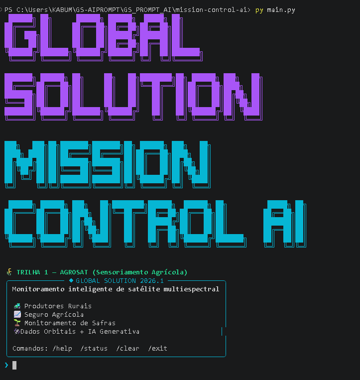
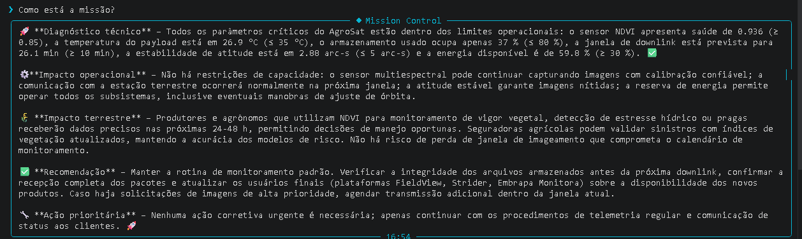

# 🚀 Mission Control AI — AgroSat

## Integrantes

* Gustavo Lima — RM: 571709 — Turma: CCPG

---

## O que o projeto faz

O AgroSat é um sistema inteligente de monitoramento de missão espacial desenvolvido para acompanhar o estado operacional de um satélite multiespectral de sensoriamento agrícola.

A solução utiliza telemetria simulada, regras automatizadas de detecção de alertas e Inteligência Artificial Generativa para interpretar o estado da missão e traduzir impactos técnicos em consequências reais para o agronegócio brasileiro.

---

## Persona atendida

### Operador de Missão Espacial

O sistema foi desenvolvido para auxiliar operadores responsáveis pelo monitoramento do satélite AgroSat. A IA atua como suporte à tomada de decisão, transformando dados técnicos de telemetria em análises operacionais claras e objetivas.

---

## Impacto e Modelo de Negócio

### 1. Qual problema real terrestre esta missão resolve?

O AgroSat busca resolver a dificuldade de monitoramento contínuo e em larga escala de áreas agrícolas. Atualmente, produtores rurais dependem de inspeções presenciais, que possuem alto custo e cobertura limitada. Com imagens multiespectrais e análise por IA, é possível identificar precocemente problemas como estresse hídrico, pragas, doenças e falhas no desenvolvimento das lavouras, permitindo ações corretivas mais rápidas e eficientes.

### 2. Quem paga pela solução?

O modelo proposto é híbrido.

* Setor público: órgãos governamentais, institutos de pesquisa e monitoramento ambiental podem utilizar os dados para planejamento agrícola e segurança alimentar.
* Setor privado: cooperativas agrícolas, seguradoras rurais, consultorias agronômicas e grandes produtores podem contratar acesso às análises e relatórios gerados pelo sistema.

### 3. Métrica de impacto

Considerando um satélite operando com disponibilidade próxima de 100% durante um ano:

* Monitoramento de milhares de hectares de áreas agrícolas.
* Identificação antecipada de problemas que podem reduzir perdas de produtividade.
* Maior eficiência no uso de água e fertilizantes.
* Apoio à tomada de decisão de produtores e cooperativas.
* Geração contínua de dados para planejamento agrícola regional.

Esses benefícios contribuem para o aumento da produtividade, redução de desperdícios e melhoria da sustentabilidade no agronegócio.

### 4. Modelo de negócio

O modelo de negócio proposto é baseado em Dados como Serviço (Data as a Service - DaaS).

Os clientes contratam acesso às informações produzidas pelo satélite e às análises geradas pela Inteligência Artificial por meio de assinaturas periódicas.

Possíveis produtos oferecidos:

* Relatórios agrícolas automatizados.
* Monitoramento de safras em tempo real.
* Alertas de anomalias em lavouras.
* Indicadores de saúde vegetal baseados em NDVI.
* Painéis de acompanhamento para cooperativas e seguradoras.

Esse modelo permite escalabilidade, atualização contínua dos dados e geração recorrente de receita.


## Tecnologias utilizadas

* Python 3.13
* Ollama Cloud API (modelo gpt-oss:120b)
* Python Dotenv
* Rich
* Prompt Toolkit
* PyFiglet
* Telemetria simulada em Python
* Engenharia de Prompt

---

## Como executar

### Requisitos

* Python 3.10+
* Chave de acesso Ollama Cloud

### Instalação

1. Clone o repositório

```bash
git clone <url-do-repositorio>
```

2. Entre na pasta do projeto

```bash
cd mission-control-ai
```

3. Crie o ambiente virtual

```bash
python -m venv .venv
```

4. Ative o ambiente virtual

Windows:

```bash
.venv\Scripts\activate
```

Linux/Mac:

```bash
source .venv/bin/activate
```

5. Instale as dependências

```bash
pip install -r requirements.txt
```

6. Crie um arquivo `.env`

```env
OLLAMA_API_KEY=sua_chave_aqui
```

7. Execute o sistema

```bash
python main.py
```

---

## Checklist de Entrega

* [x] README.md completo
* [x] Código Python funcional
* [x] requirements.txt configurado
* [x] .env.example criado
* [x] .gitignore configurado
* [x] Pasta assets com screenshots
* [x] Repositório público

---

## Demonstração

### Banner da Aplicação



### Exemplo de Análise



### Exemplo de Alerta

### Análise de Telemetria em Estado de Alerta


--- 

## System Prompt

O system prompt foi desenvolvido para orientar a IA a atuar como especialista em operações do satélite AgroSat, analisando telemetria orbital e traduzindo impactos técnicos para produtores rurais, seguradoras agrícolas e equipes de missão.

Arquivo:

```text
prompts/system_prompt.md
```

---

## Cenários de teste demonstrados

### 1. Operação Normal

Todos os parâmetros dentro da faixa operacional.

### 2. Sensor NDVI em Alerta

Redução da qualidade dos índices vegetativos utilizados no monitoramento agrícola.

### 3. Temperatura Crítica do Payload

Ativação automática do modo de proteção térmica.

### 4. Baixo Nível de Energia

Entrada em modo de economia de energia.

### 5. Instabilidade de Atitude

Possível degradação da qualidade das imagens capturadas.

### 6. Armazenamento Próximo do Limite

Priorização automática de downlink.

---

## Limitações conhecidas

* Utiliza telemetria simulada..
* Não armazena histórico persistente das análises.
* Dependente da disponibilidade da API Ollama Cloud.
* Não executa comandos reais sobre sistemas espaciais.

---

## Vídeo de demonstração

🎥 Link da apresentação:

```text
https://www.youtube.com/watch?v=SEU_VIDEO_AQUI
```

---

## Global Solution 2026.1

FIAP — Inteligência Artificial e Computação Espacial

Trilha 1 — AgroSat (Sensoriamento Agrícola)
